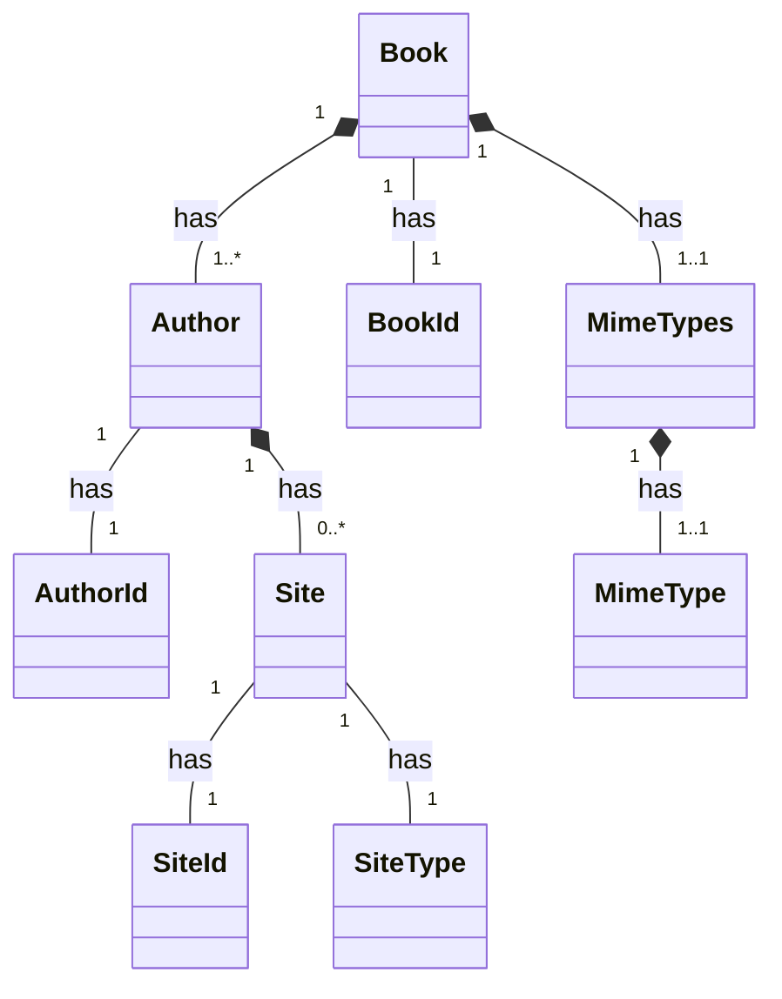
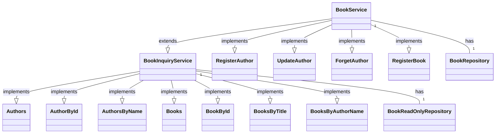
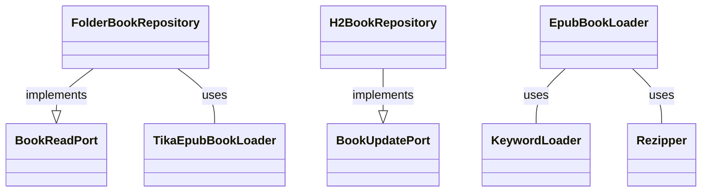

# mybooks - Hexagonal/clean architecture experiment

Entities:


Services:


Framework:

## Security
Implemented according to this [sample](https://github.com/Ozair0/Spring-Boot-3-Auth-JWT-Cookie-JPA).

To retrieve a token, the user must call login. This returns an empty response containing the token in a cookie (called 
'JWT') and in a header (also called 'JWT'). The token contains the user authorities (stored in a claim called 
'authorities'). However, in this implementation, these are not used (possibly because extracting the values is weird
using the Claims interface which creates a List with a Map inside).

As the authorities are role-based, the UserDetails puts the "ROLE_" prefix in front of it, as required by the 
```hasRole()``` method (although the parameter of that method doesn't need it). 

The JwtRequestFilter takes the token from the cookie (if available) or the JWT HTTP header (cookie can overwrite the 
header from the HTTP request). The token is validated against the UserDetails, and when valid, a 
```UsernamePasswordAuthenticationToken``` is created containing the user details, and the authorities, and set on the
```SecurityContext```. This security context is that is used by the request matchers which are configured in the 
```SecurityConfig```.

All in all, an interesting journey :-)
