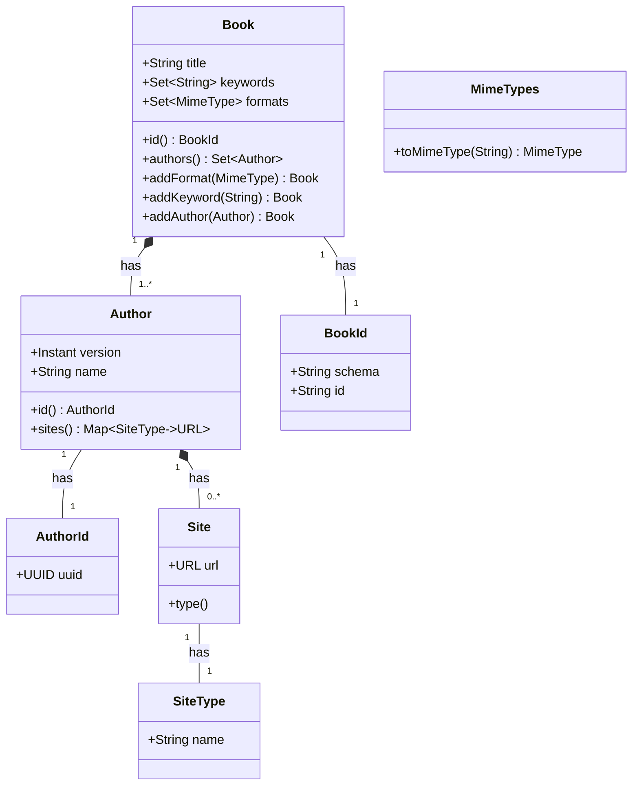
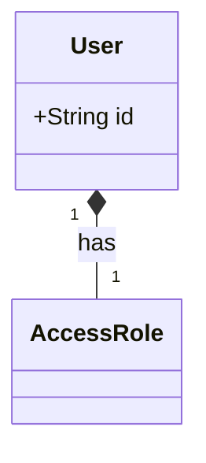
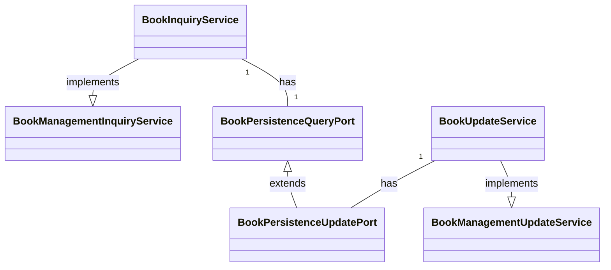
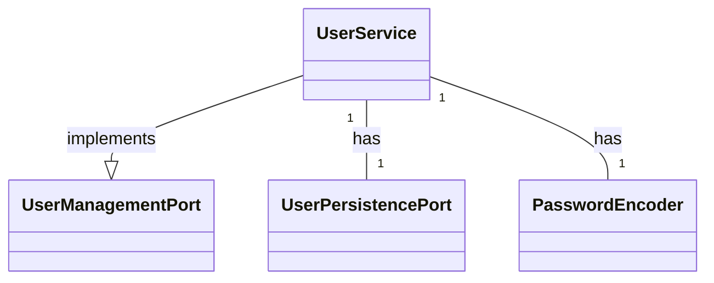
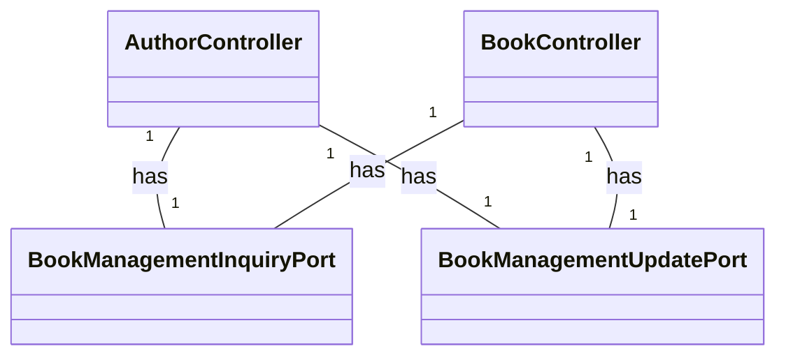
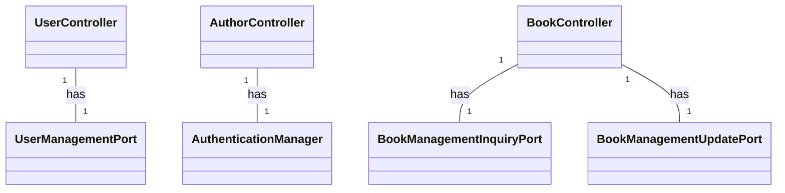
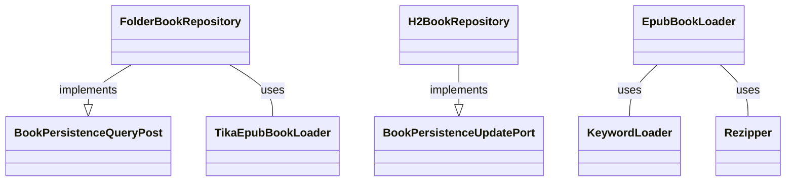
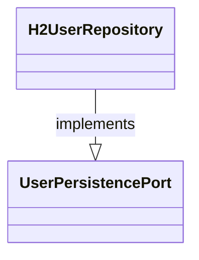

# mybooks - Hexagonal/clean architecture experiment

## History and architecture
### Start of the project
This application started with the idea to create a database with information on all ebooks I bought over 
the years. This started with using [EPUBLIB](http://www.siegmann.nl/epublib) to harvest metadata from documents
with the EPUB format. 

Although technically quite straight forward, in practice much harder. Formatting of the fields in the for instance 
the ```content.opf``` (a standard XML file with meta-data) proofed not so standard. Formatting of the ```identity```
XML element data differs, and so is information on authors (especially when there are more) as part of the 
```contributer``` XML element. 

However, once I was able to read the epub files, I decided to create an app to store the data in a database and
expose REST APIs to access the data. Being a fan of Uncle Bob, and having read his 
[Clean Architecture](https://www.amazon.com/Clean-Architecture-Craftsmans-Software-Structure/dp/0134494164), it made 
sense to actually apply these rules for a change, after working with the default layered architecture for years. 
Putting theory into practice can be a bit challenging, and that's where 
[Get Your Hands Dirty on Clean Architecture](https://reflectoring.io/book/) comes to the rescue.

Because I had some past-experience with Spring, and because writing boilerplate code is boring, I decided as well to use 
Spring Boot 3 as the core. yes, I could have opted for Quarkus, but I didn't want to complicate things too much, 
maybe in the future. 

All aspects of the application should be testable, preferably on their own. So, I will use 
[JUnit 5](https://junit.org/junit5/) and [Mockito](https://site.mockito.org/) for unit testing, not because these tools
are the best, but because it required less learning as I'd used them in the past.

I need to be fair, and give credits to [Bealdung](https://www.baeldung.com/). Everytime I needed to explore something
new (at least new to me), most of the time I found myself ending up there for great answers, explanations, and samples.

### Domain model
The domain model started simple: a BOOK has an identity (an ISBN-number of course), some attributes, a set of KEYWORDS, 
one or more FORMATS, one or more AUTHOR, and each author uses some websites for additional publicity and blogs.

Well, trying to retrieve data from EPUB books and mapping it into the domain model, wasn't that straight forward. As
said, the identity had different formats, it was certainly not always and ISBN-number, and even when a UUID was used 
as identity it proofed not to be unique (so much for identity)!

At the same time, not all books contained information about the authors, and sometimes the author attribute contained 
multiple names separated by symbols (space, comma, ampersand, or hyphen) or words ("and", "en"). Names were not always 
coded in the common western format (lastname firstname), and some people have more than one lastname (or first name). 
Parsing the data in a way that matches the domain model took some time and inspiration, and for sure cannot be always 
done right ;-)

I did not plan to use JPA (again, would take a bit more learning for me), or validation annotations on the domain, and 
the domain model was to be immutable. This means all domain models must ensure internal consistency. So, records have 
been used as domain classes (immutable), and null-checks are performed on object construction, while collections are 
ensured to be unmodifiable. 

Initially a ```MimeTypes``` class was used as a wrapper around a ```Set<MimeType>``` but this didn't add any value, so 
it was removed in favour of a more consist implementation.

The domain model is unit tested using hard-coded test data.

### Persistence
Storing book data into a persistence system, required output ports to be defined (interfaces to persist or retrieve
persisted data from the persistent store). I decided to implement the output port using two interfaces, one for 
retrieval-only (```BookPersistanceQueryPort```) and one for writing (```BookPersistanceUpdatePort```). This allowed me 
to write an implementation of the retrieval-only port directly talking to the filesystem  without implementing update 
methods as part of the implementation , while the combination of retrieval-only and writing port could be implemented 
on an SQL database (H2).

This approach enabled me to write a simple program that retrieves all books from a ```BookPersistanceQueryPort``` 
implemented on the file-system of my MacBook, and directly store the information into a ```BookPersistanceUpdatePort``` 
implemented on an H2 database.

To capture all SQL statements, including the values, I introduced ```SQLUtil``` that logs the formatted SQL statements 
including parameter values using the class logger.

The persistence implementations is unit tested using the ```@JdbcTest``` annotation from Spring, and a ```schema.sql```
to build a default in-memory H2 database, and ```data.sql.bak.bak.bak``` to load a little bit of initial test data.

### Text parsing for keywords
Getting keywords from books was a separate challenge, and it took a few cycles to find a reasonable approach. 

First I tried to get the book text using the EPUBLIB, but that proofed quite difficult. I also noticed that some books 
failed parsing. Looking for another library I ran into [Apache Tika](https://tika.apache.org/), and a nice book
[Tika in Action](https://www.manning.com/books/tika-in-action). This meant a rewrite of the ```EpubBookLoader``` to use 
Tika, but impact was limited. Tika provides a```parseToString(InputStream stream, Metadata metadata, int maxLength)``` 
that gives you meta-data and content in one go. After having switched to Apache Tika, I  noticed some books still 
caused parsing errors. For now, I ignored this issue (this has ot be solved later).

To find the keywords I first looked for a library to extract all nouns from the text. I started with 
[Apache OpenNLP](https://opennlp.apache.org/) and that worked well, though not very fast. But this approach gives way 
too many keywords, I still had to filter the list. So, I checked for lists of "IT keywords", and that Google search 
also didn't help. In the end I compiled my own list, but now I had to scan the book text for occurrences of words in 
the list. Searching for an efficient way to scan text for a series of words in one go using ChatGPT, pointed me to  
[Aho-CoraSick](https://en.wikipedia.org/wiki/Aho%E2%80%93Corasick_algorithm) which is available as Maven artefact.  
Implementation was pretty straight forward as part of the ```EpubBookLoader```.  

### Parsing errors on epub books
Now it was time to handle the problem of EPUB parsing errors, as parsing errors would lead to inaccurate keyword lists. 
I remembered having an issue with reading some of my eBooks using Adobe Digital Edition, and tools were available to 
"repair" a "broken" eBook. I started to try fixing the issue by unzipping the ebook, removing the files that caused
errors and then zip it all back together again. A ```Rezipper``` class, that unzipped into a temp folder, and then
zipped it all back together was implemented as step one. The ```EpubBookLoader``` was updated to rezip an EPUB in case 
of a parsing error after which it tried to parse the book again. Remarkably enough, this solved the issue!

### Services
Services on the domain model are defined using input ports, which are interfaces implemented by service-classes. These
services can be used by adapters (e.g. Spring Rest Controller) to adapt a service for connection to the Internet.

In contrast to the output ports, I initially separated all input ports into interfaces with all only one method as I 
initially thought this might provide additional benefit, but it didn't. Worse it made me use the 
```BookInquiryService``` directly instead of its interface. Fixing it was a bit of work, but I combined the separate 
inquiry services and update services into the ```BookManagementInqueryPort``` and ```BookManagementUpdatePort``` 
interfaces.

The ```BookInquiryService``` implements the ```BookManagementInqueryPort``` and ```BookUpdateService``` implements 
the ```BookManagementUpdatePort``` . These components can retrieve and update book data when wired to a 
```BookPersistenceInqueryPort``` and ```BookPersistenceUpdatePort``` implementation. The services do some trace logging 
at info level, parameter checking, and use the output port implementation to fulfill the service request.

The services are unit tested using mocks for the output ports. So the unit tests only validate if the expected calls are 
being made to the persistence interfaces, and not if the ports return the proper information (that's the responsibility 
of the unit tests of the output port implementations themselves).

### Web adapters for REST endpoints
And now finally, the step to link everything to the world-wide-web. I started with the ```AuthorController```, as it 
simpler than the ```BookController``` (as books have a nested ```Set<Author>```). The controller methods consume and 
produce JSON only, and are wired with a ```BookManagementInquiryPort``` and a ```BookManagementUpdatePort``` 
(implemented by the services). 

To prevent the domain model to be exposed directly through the web (also because it created quite ugly JSON), POJO's 
were created for request data (on PUT and POST requests) and response data. These have a simple ```from(DomainClass)```
factory method for convenience transformation when required. 

The controllers are relatively dumb. They take the parameters (from the request path, or the request body), 
transform string into domain data types when required (e.g. ```String``` into ```AuthorId```)  and call the input-port
(service method). When an error is returned, the error is logged (on ERROR level without stack trace, and on DEBUG 
level with stack trace) and a proper error response is returned.

Unit tests of the controllers are again just unit tests, they use mocks to validate the right calls into services are 
being made. End-to-end tests with all components wired up, are a topic to be addressed later.

### Security
Controllers need to be secure as well, and it should be the real deal, so no HTTP basic authentication, but Java 
web tokens (to start with, and OAuth 2 or OpenID Connect later).

Initially JWT security was implemented according to a 
[sample](https://github.com/Ozair0/Spring-Boot-3-Auth-JWT-Cookie-JPA) by Ozair Farahi and adapted to my personal 
liking.

Security additions were put in a separate ```security``` packages within the project structure.

To retrieve a token, the user must call 'POST /login'. This returns a JSON structure containing the token, an 
"Authorization" header with the authorization-scheme and the token, a cookie called "jwt" containing the token (a bit 
overdone indeed). The token only contains the user authorities (stored in a claim called 'authorities') as space 
separated words.

As the authorities are role-based, the ```UserDetails``` implementation puts the "ROLE_" prefix in front of the 
grant-name, as required by the ```hasRole()``` method (although the parameter of that method doesn't need this prefix).

The JwtRequestFilter takes the token from the cookie (if available) or the authorization HTTP header (cookie will
overwrite the header from the HTTP request). If the security context contains authorizations of a different user, those
are removed. Then the user is checked to be active, and then the token is validated. When valid, a
```UsernamePasswordAuthenticationToken``` is created containing the user details and the authorities, and
set on the ```SecurityContext```. This security context is what is used by the request matchers which are configured
in the```SecurityConfig```.

All in all, an interesting journey :-)

### SSL
Enabling SSL was quite simple, the process is described at 
[HTTPS using Self-Signed Certificate in Spring Boot](https://www.baeldung.com/spring-boot-https-self-signed-certificate)

The application.yml needed some additional settings to enable SSL:
```
server:
    port: 443
    servlet:
        context-path: /
    error:
        include-message: always
    ssl:
        key-store-type: PKCS12
        key-store: classpath:certificate.p12
        key-store-password: password
```

### Validation
The application has validation all over the place, every level takes care of its own validation. But at the controller
level, it has been implemented using [Jakarta Bean Validation](https://beanvalidation.org/). 

This worked best with fine-grained request and response POJO's for the controllers. For some of the properties custom
validations were required (e.g. for an object ID, which was implemented with a UUID).

Adding validation annotations wasn't that much of an issue. Unit testing required some help of 
[Stackoverflow](https://stackoverflow.com/questions/28768577/how-to-test-a-validator-which-implements-constraintvalidator-in-java).

Testing the annotation on the controllers using Postman. Initially it seemed to trigger the validation but didn't 
generate the expected response, as it didn't return the expected ```400 BAD_REQUEST``` response, but a 
```403 FORBIDDEN``` response. This was caused by my choice to require access to all paths to be authenticated, but this 
also required authentication on  the ```/error``` path used to render the error situations. This required a minor change 
to the ```SecurityConfig```. 

Proper rendering of validation errors required a ```ValidationExceptionHandler``` with a controller advice to catch and 
render ```ConstraintViolationException``` and ```MethodArgumentNotValidException```. Getting the request path in the 
error, required some experiments, but proofed pretty straight forward by adding the ```ServletRequest``` to the handler 
as parameter. Somehow Spring didn't take a ```HttpServletRequest``` as first parameter to the handler. When the type of 
the first parameter was set to ```HttpServletRequest```, the  handler wasn't called anymore, but using 
```ServletRequest``` did work okay.

### Stronger passwords
[Passay](http://www.passay.org/) provides some validation rules to test passwords for rules (e.g. special characters,
character repetition, etc.). It was just a nice step to implement this with a ```PasswordConstraint``` 
(custom bean validator). 

### End-to-end tests
The validations do not kick in on unit tests, they require at least a mocked web environment to be tested. Of course, 
you can test using [Postman](https://www.postman.com/) or some other tool, but I guess that is not even that easy when 
using security tokens you get after login and must be passed though a header. Possibly Postman has a standard solution, 
but I didn't want to invest time on that. Nonetheless, automated end-to-end tests with as little additional technology as 
possible was preferred.

Using ```@SpringBootTest``` and ```@AutoConfigureMockMvs``` made end-to-end testing pretty easy. I was able to check proper 
response codes on errors and proper error messages. 

With [Jackson FasterXML](https://github.com/FasterXML/jackson) it was quite straight forward to transform JSON responses 
back into POJO's for additional validation of the content of the response body, or to set the content on the request 
body.   

### Set<?> instead of List<?>
When reading on JPA and Hibernate, I read about using ```Set``` instead of ```List```, as a Set is more safe, because 
it cannot accidentally contain duplicate entities. That made sense, so I changed it throughout the entire application. 

### Actuator
```
management:
    endpoints:
        web:
            exposure:
                include: health, metrics, info
    endpoint:
        health:
            show-details: always
            show-components: always
```

### Using Cucumber
It looked like a nice idea to enable BDD style end-to-end tests using Cucumber. I worked with 
[Fitnesse](https://github.com/unclebob/fitnesse) before, and it was an interesting way to write and execute tests.
I decided to try something else this time. The first steps where easy, as there is a good 
[Cucumber Spring Integration](https://www.baeldung.com/cucumber-spring-integration).

The Gerkin feature descriptions are stored in ```src/test/resources/features```, and the end-2end test runner is 
implemented by ```MyBooksApplicationE2E```. It's an empty class annotated to run with Cucumber, and with a
configuration setting to the right folder for the feature files.

The ```MyBooksE2EBase``` provides base class for the annotated test steps. It contains the methods for sending HTTP 
requests (GET, POST, PUT), making a login for a user with the USER_ROLE and a user with the ADMIN_ROLE. After a login
the JWT is stored, so it can be used on subsequent requests that require authentication.

```MyBooksE2EStepDef``` contains the individual steps, and the methods use the lower level features provided by the 
base class.

Making it all work using SSL proofed quite a challenge. Spring Boot 3 made quite some changes on the use of the Apache 
HTTP client (now using v5 instead of v4). It took some research, and it required an additional dependency in the pom file
```
<dependency>
    <groupId>org.apache.httpcomponents.client5</groupId>
    <artifactId>httpclient5</artifactId>
    <scope>test</scope>
</dependency>
```

Next, the setup of the ```RestTemplate``` needed to change, to ensure the template would use an ```HttpRequestFactory``` 
that actually uses an SSL connection. It took some searching as the articles at Bealdung mostly use Spring Boot 2,
and especially that part changed considerably. The description that worked (although I slightly changed my 
implementation) also refers to Spring Boot 2, but it did use the right approach. 
[Configuring HttpClient with Spring RestTemplate](https://howtodoinjava.com/spring-boot2/resttemplate/resttemplate-httpclient-java-config/)

The ```SSLRestTemplateConfiguration``` (src/test/java) contains the bean definition for ```RestTemplate``` to be used
for SSL connections. The ```SSLContext``` needs access to the certificate (trust material). To prevent additional issues
the ```SSLConnectionSocketFactory``` must not check the host name of the certificate (use ```NoopHostnameVerifier```). 

A ```Registry<ConnectionSocketFactory>``` must have an ```ConnectionSocketFactory``` for http, and https (the one
just created, while the factory for http is a plan simple one). Then you need an ```PoolingHttpClientConnectionManager```,
and an HttpClient using the connection manager, and a ```HttpComponentsClientHttpRequestFactory``` using the 
```HttpClient```. In the final step, create a RestTemplate using the request factory.

Details on Cucumber expressions for the given/when/then/and clauses are documented 
[here](https://github.com/cucumber/cucumber-expressions#readme).  Actually, the implementation of the BDD tests was 
quite simple, once you get the relationships between the different 
files and components.

Possible nest step, is tp replace the use of the RestTemplate with something like 
[RestAssured](https://rest-assured.io/), that might be my next refactoring :-D 

## GraphQL
Implementation of a GraphQL interface was actually quite straight forward. The ```schema.graphqls``` has been added
to ```main/resources/graphql```, and the implementing classes have been put in a separate package
called ```com.putoet.mybooks.books.adapter.in.graphql```.

In order to return a map (with sites) for an author, a KeyValuePair record was created, and specific response
types have been added (```GraphqlAuthorResponse``` and ```GraphqlBookResponse```). 

For proper response on not-found situations (e.g. book with id not found), the ```NotFoundException``` was
introduced and linked into the framework using the ```NotFoundExceptionResolver```.

In order to test using Graphiql (required additional setting in the ```application.yml```), security
on the GraphQL interface was disabled in the security configuration.

## RestAssured
Replacing the use of the RestTemplate with [rest-assured](https://rest-assured.io/), was pretty easy. It also
allowed cleanup as the rest assured framework handles https out of th e box. It also knows how to
translate (map) responses given a class type, so no need to pass an ObjectMapper.

## Recreating the database from scratch
This feature has been implemented as a test. During testing of the feature I discovered a couple of new things as well. 

When running a test annotated with ```@JdbcTest``` the test will use the ```schema.sql``` and ```data.sql``` files to 
create an in-memory H2 database, while ignoring most of the database settings in yoor ```application.yml```. To run 
the tests against a real database, you need to use ```@SpringBootTest``` and ```@AutoConfigureMockMvc```. 

When running a test annotated with ```@AutoConfigureTestDatabase(replace = AutoConfigureTestDatabase.Replace.NONE)```, 
to prevent the real database from being replaced by the in-memory test version. This doesn't prevent the loading
of test data from the ```data.sql```, so that should be renamed before running the test. 

While playing around with this feature, I noticed duplicates in the Author-table. This was caused by the 
```FolderBookRepository``` that created an Author for every author-name linked to any book. This was fixed, by
removing all duplications after loading book data and before returning from the constructor (duplicate authors
are being removed, and only the first author with a specific name is stored and linked to the books). 

## Class models

domain:


domain.security:


application:


application.security:


adapter.in.web:


adapter.in.web.security:


adapter.out.persistence:


adapter.out.security:


