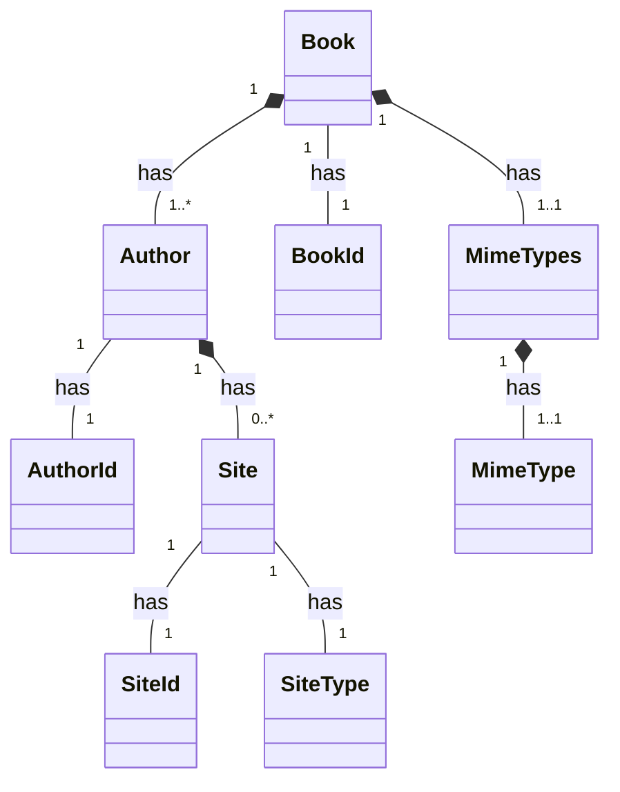
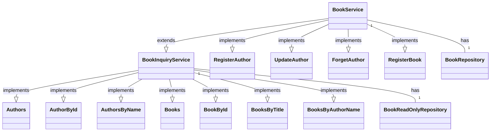
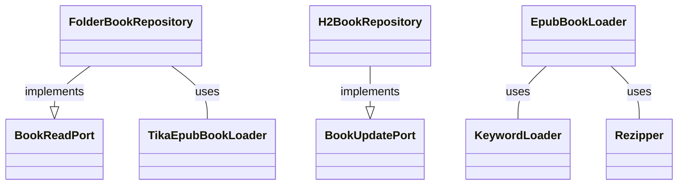

# mybooks - Hexagonal/clean architecture experiment

## History and architecture
### Start of the project
This application started with the idea to create a database with information on all ebooks I bought over 
the years. And it all started with using [EPUBLIB](http://www.siegmann.nl/epublib) to fetch data from documents
with the EPUB format. 

Although technically quite straight forward, in practice much harder. Formatting of the fields in the for instance 
the ```content.opf``` (a standard XML file with meta-data) proofed not so standard. Formatting if ```identity```
data differs, and so is information on authors (especially when there are more). 

However, once I was able to read the epub files, I decided to create an app to store the data in a database and
expose REST APIs to access the data. Being a fan of Uncle Bob, and having read his 
[Clean Architecture](https://www.amazon.com/Clean-Architecture-Craftsmans-Software-Structure/dp/0134494164), I decided 
to actually apply it, after working with the default layered architecture for years. Putting theory into practice can 
be a bit challenging, so I also got myself [Get Your Hands Dirty on Clean Architecture](https://reflectoring.io/book/).

Because I had some past-experience with Spring, and because I hate all the boilerplate code, I decoded to use 
Spring Boot 3 as the core. yes, I could have opted for Quarkus, but I didn't want to complicate things too much, 
maybe in the future. 

### Domain model
The domain model was simple: a BOOK has an identity (ISBN of course), some attributes, a set of KEYWORDS, one 
or more FORMATS, always one or more AUTHORs, and each author has one some websites for additional publicity and blogs.

Well, trying to retrieve data from EPUB books and mapping it into the domain model, wasn't that straight forward. As
said, the identity had different formats, certainly not always and ISBN-number, and proofed even not to be unique!!!

At the same time, not all books contained information about the authors, and sometimes the author attribute contained 
multiple names separated by symbols (comma, or hyphen) or words (and, en). Parsing the data in a way that matches the
domain model took some time and inspiration ;-)

### Persistence
Storing book data into a persistence system, required output ports to be defined (interfaces to persist or retrieve
persisted data from the persistent store). I decided to implement the output port using two interfaces, one for 
retrieval-only (```BookQueryPort```) and one for writing (```BookUpdatePort```). This allowed me to write an 
implementation of the retrieval-only port directly talking to the filesystem, while the combination of retrieval-only 
and writing port was implemented on an SQL database (H2).

This approach enabled me to write a simple program that retrieves all books from a ```BookQueryPort``` implemented on
the file-system of Mac, and directly store the information into a ```BookUpdatePort``` implemented on an H2 database.

### Text parsing for keywords
Getting keywords from books was a separate challenge, and it took a few cycles to find a reasonable approach. 

First I tried to get the book text using the EPUBLIB, but that proofed quite difficult. I also noticed that some books 
failed parsing. Looking for another library I ran into [Apache Tika](https://tika.apache.org/), and a nice book
[Tika in Action](https://www.manning.com/books/tika-in-action) describing how to use it. I had to rewrite my 
```EpubBookLoader``` to use Tika, but luckily not too much. Tika provides a 
```parseToString(InputStream stream, Metadata metadata, int maxLength)``` that gives you meta-data and content in 
one go. After having switched to Apache Tika, I  noticed some books still caused parsing errors. For now, I ignored 
this issue.

To find the keywords I first looked for a library to extract all nouns from the text. I started with 
[Apache OpenNLP](https://opennlp.apache.org/) and that worked well, though not very fast. But this approach gives way 
too much keywords, I still had to filter the list. So, I checked for lists of "IT keywords", well that Google search 
also didn't help. In the end I compiled my own list, but now I had to scan the book text for occurrences of words in 
the list. First IO got rid of OpenNLP, and then searched for an efficient way to scan text for a series of words in one 
go, hoping someone would have solved that problem already. And, indeed the 
[Aho-CoraSick](https://en.wikipedia.org/wiki/Aho%E2%80%93Corasick_algorithm) does exactly that and there is even 
a maven artefact available. So now, I was able to extract book data and create a set of keywords that are in the book.

### Parsing errors
Now it was time to handle the parsing errors, as parsing errors would lead to inaccurate keyword lists. I remembered 
having an issue with reading some of my eBooks using Adobe Digital Edition, and tools were available to "repair" a 
broken eBook. I first try to find and use a more sophisticated ZIP library, but that was very difficult to integrate 
with Tika or EPUBLIB. I then decided to try to fix the issue by unzipping the ebook, removing the files that caused
errors and then zip it all back together again. I started with a rezipper, that unzipped into a temp folder, and then
zipped it all back together. Linked this into the ```EpubBookLoader```, so after an error a book was rezipped and 
loaded again using Tika. Remarkably enough, this already solved the issue!


## Class models

Entities:


Services:


Framework:


## Security
Initially implemented according to this [sample](https://github.com/Ozair0/Spring-Boot-3-Auth-JWT-Cookie-JPA).

To retrieve a token, the user must call login. This returns a JSON structure containing the token, an "Authorization"
header with the authorization-scheme and the token, a cookie called "jwt" containing the token (a bit overdone indeed). 
The token contains the user authorities (stored in a claim called 'authorities') as space separated words. 

As the authorities are role-based, the UserDetails puts the "ROLE_" prefix in front of it, as required by the 
```hasRole()``` method (although the parameter of that method doesn't need it). 

The JwtRequestFilter takes the token from the cookie (if available) or the authorization HTTP header (cookie will 
overwrite the header from the HTTP request). If the security context contains authorizations of a different user, those 
are removed. Then the user is checked to be active, and then the is validated, and when valid, a
```UsernamePasswordAuthenticationToken``` is created containing the user details, and the authorities, and 
set on the ```SecurityContext```. This security context is what is used by the request matchers which are configured 
in the```SecurityConfig```.

All in all, an interesting journey :-)
