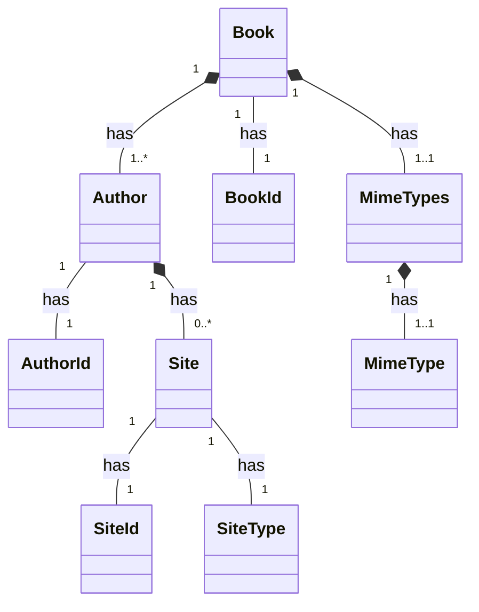
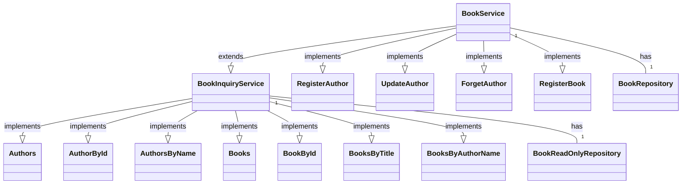
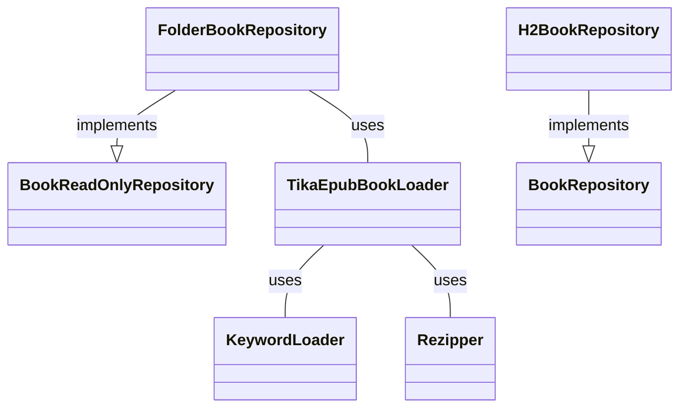

# mybooks - Hexagonal/clean architecture experiment

Entities:

```mermaid
classDiagram
    Author "1" -- "1" AuthorId: has
    Author "1" *-- "0..*" Site: has
    Site "1" -- "1" SiteId: has
    Site "1" -- "1" SiteType: has
    Book "1" *-- "1..*" Author: has
    Book "1" -- "1" BookId: has
    Book "1" *-- "1..1" MimeTypes: has
    MimeTypes "1" *-- "1..1" MimeType: has
```

Services:

```mermaid
classDiagram
    BookInquiryService --|> Authors: implements
    BookInquiryService --|> AuthorById: implements
    BookInquiryService --|> AuthorsByName: implements
    BookInquiryService --|> Books: implements
    BookInquiryService --|> BookById: implements
    BookInquiryService --|> BooksByTitle: implements
    BookInquiryService --|> BooksByAuthorName: implements
    BookService --|> BookInquiryService: extends
    BookService --|> RegisterAuthor: implements
    BookService --|> UpdateAuthor: implements
    BookService --|> ForgetAuthor: implements
    BookService --|> RegisterBook: implements
    
    BookInquiryService "1" -- "1" BookReadOnlyRepository: has
    BookService "1" -- "1" BookRepository: has
```

Framework:

```mermaid
classDiagram
    FolderBookRepository --|> BookReadOnlyRepository: implements
    FolderBookRepository -- TikaEpubBookLoader: uses
    H2BookRepository --|> BookRepository: implements
    TikaEpubBookLoader -- KeywordLoader: uses
    TikaEpubBookLoader -- Rezipper: uses
```
